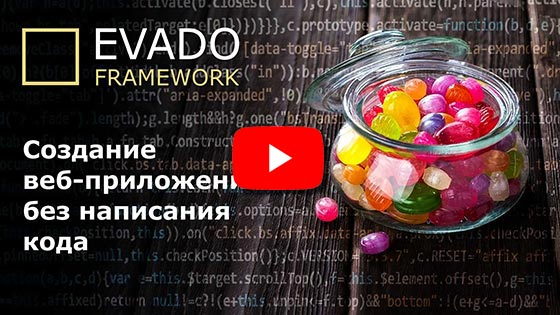

[English version](https://github.com/Logonok/bugs-en)

# Система отслеживания ошибок

Веб-приложение для отслеживания ошибок в проектах и их исправлений,
созданное без написания кода
на [декларативном фреймворке Evado](https://github.com/mkhorin/evado).

#### Алгоритм работы

- Администратор создает сотрудников и назначает им роли (менеджер, исполнитель).
- Администратор создает проекты для отслеживания ошибок.
- Менеджер создает задачу, в которой описывает найденный в проекте дефект.
Если требуется, то прикладывает дополнительные файлы (например, скриншоты и т.п.).
- Менеджер назначает исполнителя задачи, который отвечает за устранение ошибки.
- Исполнитель решает задачу и отдает ее на проверку. 
- Менеджер проверяет решение и, если дефект устранен, то закрывает задачу,
иначе возвращает ее на доработку.

К задаче можно добавлять комментарии для оперативного решения возникающих вопросов.
Кроме того сотрудники могут вести учет затраченного времени.

[](https://youtu.be/dKVPgGAH6CA)

## Типовая установка

#### Установите окружение
- [Node.js](https://nodejs.org) (version 12)
- [MongoDB](https://www.mongodb.com/download-center/community) (version 4)

#### Linux
Клонируйте приложение в /app
```sh
cd /app
npm install
NODE_ENV=development node console/install
NODE_ENV=development node console/start
```

#### Windows
Клонируйте приложение в c:/app
```sh
cd c:/app
npm install
set NODE_ENV=development
node console/install
node console/start
```

## Установка через Docker

Клонируйте приложение в /app
```sh
cd /app
docker-compose up -d mongo
docker-compose up --build installer
docker-compose up -d server
```

## Использование

Веб-интерфейс: **http://localhost:3000**

Войти как исполнитель:
```sh
Email: b@b.b
Password: 123456
```
Войти как менеджер:
```sh
Email: s@s.s
Password: 123456
```
Войти как администратор:
```sh
Email: a@a.a
Password: 123456
```